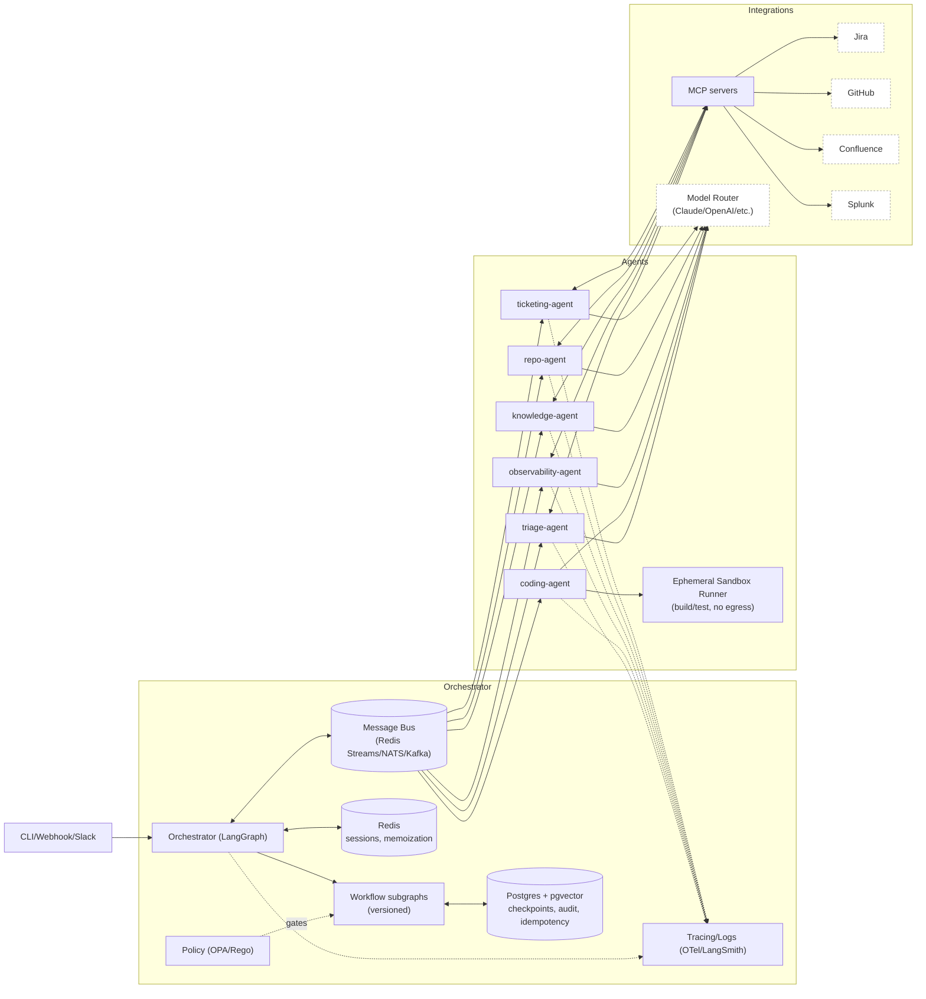

# Multi-Agent Platform (MAP)

## Overview

MAP is a multi-agent orchestration platform built on LangGraph that enables teams to create and manage automated workflows using specialized AI agents. The platform provides a modular architecture where each agent operates as an independent microservice, communicating through standardized interfaces and message buses.

The system is designed for teams that need to automate complex, multi-step processes involving different tools and services. Common use cases include customer support triage, code review automation, incident response, and DevOps pipeline management.

The architecture prioritizes modularity, safety, and observability: each agent runs in its own container with independent scaling, scoped capabilities, and Postgres/Redis-backed persistence.

---

## System Architecture

- **Orchestrator (LangGraph)**  
  - Receives triggers (Slack, webhook, CLI, etc.)  
  - Distills requests into a **workflow ID**  
  - Routes execution across agents via **workflow subgraphs**
  - **Serves as the communication protocol** - agents communicate through LangGraph's state management and message passing

- **Agents**  
  - Specialized microservices (ticketing, repo, knowledge, observability, coding, triage)  
  - Communicate via **MCP servers** or APIs  
  - Configurable, independent, and easily extendable  

- **Persistence**  
  - **Postgres + pgvector** for workflow checkpoints, state, and idempotency  
  - **Redis** for session caching, memoization, and queues  

- **Orchestration**  
  - **Message bus (Redis Streams / NATS / Kafka)** for async communication and retries  
  - **Idempotency keys** per step for safe retries  
  - **Policy engine (OPA/Rego)** to enforce capability restrictions  

- **Security**  
  - Scoped API tokens (Jira PATs, GitHub App tokens, etc.)  
  - Agent-level network egress restrictions  
  - Secrets stored in Vault/Cloud KMS (not `.env` in prod)  

- **Observability**  
  - Structured JSON logs (with correlation_id & workflow_id)  
  - **Tracing (OTel / LangSmith)** across orchestrator + agents  
  - Dead-letter queue for failed steps  

- **Sandboxing (coding agent)**  
  - Code build/test happens inside **ephemeral runner sandboxes** (e.g., Firecracker/isolated containers)  
  - No outbound network egress except package mirrors  
  - Artifacts exported as patches  

---

## Architecture Diagram



---

## Workflow Implementation

Workflows are built as **LangGraph subgraphs** and can run in **parallel** or **sequential** steps. The orchestrator acts as a simple orchestrator that routes requests and manages workflow state, but does not make complex decisions itself.

**Orchestrator Design**: The orchestrator is a simple passthrough that only applies intelligence to determine which workflow to trigger based on the initial request. All subsequent routing decisions are predefined in the workflow definition. The final response comes from a sub agent, passed along by the orchestrator.

**Communication Model**: Agents don't communicate directly with each other - all communication flows through LangGraph's state management system. This provides built-in message serialization, state persistence, checkpointing, and replay capabilities without requiring a separate communication protocol.

- **Triage Workflow**  
  - Steps: ticketing → knowledge → observability (parallel)  
  - Results aggregated by triage-agent which provides final response to user via orchestrator passthrough  

- **Coding Workflow**  
  - Steps: ticketing → coding → repo (sequential)  
  - Orchestrator checkpoints after each step  

### Example (YAML-style declarative workflow)
```yaml
id: triage_workflow_v1
version: 1.0.0
steps:
  - id: fetch_ticket
    agent: ticketing-agent
    output: ticket_data
  - id: parallel_analysis
    type: parallel
    steps:
      - id: check_knowledge
        agent: knowledge-agent
        input: ticket_data
        output: knowledge_results
      - id: check_observability
        agent: observability-agent
        input: ticket_data
        output: observability_results
  - id: make_decision
    agent: triage-agent
    input: [knowledge_results, observability_results]
    output: triage_decision
```

```yaml
id: coding_workflow_v1
version: 1.0.0
steps:
  - id: fetch_ticket
    agent: ticketing-agent
    output: ticket_id
  - id: implement_fix
    agent: coding-agent
    input: ticket_id
    output: patch
    sandbox: true
    approval_required: true
  - id: create_pr
    agent: repo-agent
    input: patch
    output: pr_url
```

---

## Design Principles

- **Modular Architecture**: Agents operate as independent microservices with standardized communication interfaces
- **LLM Integration**: Natural language interfaces for workflow configuration and agent interaction
- **API-First Design**: All platform functionality accessible through REST APIs and programmatic interfaces  
- **Extensibility**: Plugin architecture for adding new agents and integrations
- **Declarative Workflows**: YAML-based workflow definitions compiled to LangGraph execution graphs
- **Security by Default**: Sandboxed execution environments, scoped authentication tokens, and capability restrictions
- **Configuration Management**: Environment-specific config sets supporting development, staging, and production deployments
- **Observability**: Distributed tracing and structured logging with correlation IDs across all components

---

## Technical Improvements

1. **Typed workflow state** using Pydantic validators → safer than free-text LLM passing  
2. **Parallel + join workflows** in LangGraph → faster triage patterns  
3. **Interrupts / approvals** for sensitive actions (ticket status change, PR creation)  
4. **Workflow versioning** stored in Postgres → rollback/replay support  
5. **Bus decoupling** → retries, backpressure, and async workflows  
6. **Sandboxing** for coding agent → safe build/test without repo tampering  
7. **Policy enforcement** with OPA/Rego → enforce capability restrictions dynamically  
8. **Unified deployment** → all agents expose LangGraph API servers (standardized)  

---

## Development Roadmap

- [ ] Implement Workflow Builder UI with drag-drop interface and YAML generation
- [ ] Develop Run Viewer for workflow execution monitoring and checkpoint management
- [ ] Build Agent and Workflow Marketplace for component sharing and reuse
- [ ] Integrate continuous model evaluation with golden task datasets
- [ ] Migrate secret management to Vault/KMS infrastructure
- [ ] Implement Redis Streams as primary message bus backend
