# Multi-Agent Orchestration Platform

## 📋 Table of Contents

- [Overview](#overview)
- [Architecture](#architecture)
- [Quick Start](#-quick-start)
- [Workflow Examples](#workflow-examples)
- [Development](#-development)
- [Project Structure](#-project-structure)
- [Testing & Monitoring](#-testing--monitoring)
- [Troubleshooting](#troubleshooting)

## Overview

A distributed microservices platform for orchestrating AI agents across different domains. Each agent specializes in specific tasks (code, tickets, repos, knowledge, monitoring) and can be developed, deployed, and scaled independently.

**Key Features:**
- **Hub-and-spoke orchestration** with supervisor routing workflows
- **Independent microservices** with dedicated compose files
- **Direct agent-to-external API** connections via MCP protocol
- **Future-ready** for multi-repository team development

## Architecture


### Core Services

- **supervisor** (Port 8001): Central orchestrator with LangGraph workflow engine
  - Routes requests to appropriate domain agents via LangGraph API
  - Maintains workflow state and checkpoints via LangGraph persistence
  - Implements resumable workflows with built-in state management

- **coding_agent** (Port 8002): LangGraph agent for code operations
  - **LangGraph API server**: Native graph execution with streaming support
  - **Direct git operations**: Uses git commands for repository management
  - **Local file system access**: Works directly with repository files and build artifacts
  - Handles code analysis, review, and automated improvements

- **Domain agents** (Ports 8004-8007): LangGraph API servers for specialized tasks
  - **ticketing_agent**: LangGraph agent for Jira operations via MCP protocol
  - **repo_agent**: LangGraph agent for GitHub/GitLab operations via MCP protocol  
  - **knowledge_agent**: LangGraph agent for Confluence + vector search via MCP protocol
  - **observability_agent**: LangGraph agent for Splunk search and monitoring via MCP protocol

- **mcp_servers** (Port 8003): External system integration layer
  - Protocol servers for Jira, GitHub, Confluence, and Splunk
  - Standardized MCP interface for external API access

### Security & Access Control

| Agent | Allowed Access | Security Boundary |
|-------|---------------|-------------------|
| coding-agent | LLM providers only | No external system access |
| ticketing-agent | Jira Cloud/DC only | No GitHub/repo access |
| repo-agent | GitHub/GitLab only | No Jira/ticketing access |
| knowledge-agent | Confluence + Vector DB | Read-focused with controlled writes |
| observability-agent | Splunk search only | Read-only operations |

### Workflow Execution Pattern

1. **Client** sends request to supervisor
2. **Supervisor** determines workflow based on request type and routes to agents
3. **Workflow subgraphs** define step-by-step execution across multiple agents
4. **Agents execute** their specific tasks with:
   - **Direct git operations** for coding agent (clone, pull, commit, push)
   - **Direct MCP calls** to external systems for other agents (Jira, GitHub, Confluence, Splunk)  
   - **Database API calls** for persistent data storage and retrieval
   - **LLM calls** for AI-powered decision making and content generation
5. **Agents report results** back to supervisor for workflow coordination
6. **Supervisor maintains** workflow state and coordinates next steps
7. **Checkpointing** enables pause/resume of long-running workflows

**Key Design Principles:**
- **Agent Autonomy**: Agents make direct external API calls without supervisor proxy
- **Microservices Communication**: Well-defined APIs between all components
- **Fault Isolation**: Individual agent failures don't cascade to other services
- **Independent Scaling**: Each agent scales based on its specific workload

## 🚀 Quick Start

### Prerequisites

- Docker and Docker Compose
- Anthropic API key
- GitHub token (for MCP server)

### Setup

```bash
# 1. Copy and configure environment
cp .env.example .env
# Edit .env with your API keys:
# - ANTHROPIC_API_KEY=your_key_here
# - GITHUB_TOKEN=your_token_here

# 2. Start all services
docker-compose up

# 3. Verify health
curl http://localhost:8001/healthz  # Supervisor
curl http://localhost:8002/healthz  # Coding Agent
curl http://localhost:8003/healthz  # MCP Servers

# 4. Run system tests
python test_system.py
```

### Development Workflows

**Full System Development:**
```bash
# All services with hot reload
docker-compose up --build
```

**Individual Component Development:**
```bash
# Work on coding agent in isolation (includes volumes)
cd coding_agent
docker-compose up --build

# Work on specific domain agents
cd ticketing_agent
docker-compose up --build

cd repo_agent
docker-compose up --build

cd knowledge_agent
docker-compose up --build

cd observability_agent
docker-compose up --build

# Work on database services independently
cd databases
docker-compose up --build

# Work on MCP servers independently
cd mcp_servers
docker-compose up --build
```

**Multi-Service Development:**
```bash
# Database + specific agent (common pattern)
docker-compose -f databases/docker-compose.yml \
               -f ticketing_agent/docker-compose.yml up

# Coding agent + database + MCP servers
docker-compose -f databases/docker-compose.yml \
               -f coding_agent/docker-compose.yml \
               -f mcp_servers/docker-compose.yml up
```

### First Flow Execution

```bash
# Run example flow
python examples/flow_execution_example.py

# Or test individual services
python examples/test_services.py
```

## Workflow Examples

### Coding Workflow (Primary Use Case)

The most common workflow pattern for issue-driven development:

```mermaid
flowchart TD
  START[Client Request] --> SUP[Supervisor]
  
  SUP --> |"coding_flow"| WF["🔧 Coding Workflow"]
  
  WF --> CF1["Step 1: Fetch Ticket Details<br/>(ticketing_agent)"]
  CF1 --> CF2["Step 2: Implement Solution<br/>(coding_agent)"]
  CF2 --> CF3["Step 3: Raise Pull Request<br/>(repo_agent)"]
  
  classDef workflow fill:#e1f5fe,stroke:#0277bd;
  classDef step fill:#f3e5f5,stroke:#7b1fa2;
  classDef start fill:#e8f5e8,stroke:#2e7d32;
  
  class WF workflow;
  class CF1,CF2,CF3 step;
  class START,SUP start;
```



**Workflow Definition Example:**
```yaml
name: coding_workflow
description: "Issue-driven development workflow with pull request creation"
steps:
  - name: fetch_ticket_details
    type: ticketing_agent
    action: get_issue
    
  - name: implement_solution
    type: coding_agent
    action: analyze_and_implement
    
  - name: raise_pull_request
    type: repo_agent
    action: create_pr
    confirm_writes: true
```

### Additional Workflow Types

```mermaid
flowchart TD
  START[Client Request] --> SUP[Supervisor]
  
  SUP --> |"code_review_flow"| WF1["🔍 Code Review Workflow"]
  SUP --> |"issue_triage_flow"| WF2["🎫 Issue Triage Workflow"]
  SUP --> |"coding_flow"| WF3["🔧 Coding Workflow"]
  SUP --> |"monitoring_flow"| WF4["📊 Monitoring Workflow"]
  
  WF1 --> CR1["Analysis"] --> CR2["Improvements"] --> CR3["PR Creation"]
  WF2 --> IT1["Classification"] --> IT2["Assignment"] --> IT3["Notification"]
  WF3 --> CF1["Fetch Ticket"] --> CF2["Implement"] --> CF3["Create PR"]
  WF4 --> MF1["Metrics Analysis"] --> MF2["Alert Creation"] --> MF3["Runbook Updates"]
  
  classDef workflow fill:#e1f5fe,stroke:#0277bd;
  classDef step fill:#f3e5f5,stroke:#7b1fa2;
  classDef start fill:#e8f5e8,stroke:#2e7d32;
  
  class WF1,WF2,WF3,WF4 workflow;
  class CR1,CR2,CR3,IT1,IT2,IT3,CF1,CF2,CF3,MF1,MF2,MF3 step;
  class START,SUP start;
```



- **Code Review Flow**: Analysis → Improvements → PR Creation
- **Issue Triage Flow**: Classification → Assignment → Notification  
- **Knowledge Sync Flow**: Documentation → Vector Embedding → Search Index
- **Monitoring Flow**: Metrics Analysis → Alert Creation → Runbook Updates

## 🔧 Development

### Team Development Model

Each service can be developed independently by different teams:

**Database Team:**
```bash
cd databases
docker-compose up  # PostgreSQL + Redis + API layer
```

**MCP Integration Team:**
```bash
cd mcp_servers  
docker-compose up  # All MCP protocol servers
```

**Supervisor Team:**
```bash
cd supervisor
docker-compose up  # LangGraph orchestrator service
```

**Coding Agent Team:**
```bash
cd coding_agent
docker-compose up  # Coding agent + persistent volumes
```

**Domain Agent Teams:**
```bash
# Each domain agent team works independently
cd ticketing_agent && docker-compose up
cd repo_agent && docker-compose up
cd knowledge_agent && docker-compose up
cd observability_agent && docker-compose up
```

### Migration to Separate Repositories

When ready to split agents into separate repositories:

1. **Move agent directory** to new repository
2. **Remove include line** from root `docker-compose.yml`
3. **Update networking** (use external networks if needed)
4. **No service definition changes** required

### State Management

#### **Workflow State (PostgreSQL)**
Persistent execution state of multi-step workflows that must survive system restarts.

**Example**:
```json
{
  "workflow_id": "wf_code_review_123",
  "flow_name": "code_review_flow", 
  "status": "in_progress",
  "current_step": "step_2_generate_pr",
  "step_results": {
    "step_1_analyze": {
      "agent": "coding_agent",
      "findings": ["Security issue in auth.py"],
      "completed_at": "2025-01-15T10:15:00Z"
    }
  }
}
```

#### **Session State (Redis)**
Temporary, high-performance data for active sessions and real-time operations.

**Example**:
```redis
# API response cache (expires in 5 minutes)
SETEX "cache:jira_issues:project_DEV" 300 '{"issues": [...]}'

# Active build status (real-time updates)
SET "build:status_repo_123" '{"progress": 75, "stage": "running_tests"}'
```

### Repository Storage (Coding Agent)

```
/app/repositories/          # Docker volume: coding_agent_repos
├── org1/
│   ├── repo1/             # Full git repository (cloned via git commands)
│   └── repo2/             # Full git repository  
└── org2/
    └── repo3/             # Full git repository

/app/builds/               # Docker volume: coding_agent_builds  
├── org1_repo1/           # Build artifacts, test results
├── org1_repo2/           # Compilation cache, dependencies
└── org2_repo3/           # CI/CD artifacts
```

### Security Features

#### Write Protection

- **Environment Gates**: `CONFIRM_WRITES=true` blocks destructive operations
- **Explicit Confirmation**: Write operations require explicit approval
- **Repository Allowlists**: MCP servers enforce org/repo restrictions
- **Read-Only Default**: All operations default to read-only mode

#### Configuration

```bash
# Environment variables for security
CONFIRM_WRITES=true                    # Require write confirmation
GITHUB_ALLOWED_ORGS=org1,org2         # Allowed GitHub orgs
GITHUB_ALLOWED_REPOS=org/repo1,org/repo2  # Specific repo allowlist
ENVIRONMENT=production                 # Environment-based restrictions
```

**Knowledge Agent Vector Storage:**
- **Document Embeddings**: Stored in `knowledge_agent_schema` with pgvector
- **Search Indexes**: Fast retrieval for RAG operations  
- **Content Versioning**: Track documentation changes and updates

**Shared Configuration Management:**
- **API Credentials**: Securely stored in `shared_config_schema`
- **Org/Repo Allowlists**: Access control and security boundaries
- **User Preferences**: Workflow customizations and approval settings

**Benefits of Volume-Based Storage:**
- **Container Restart Resilience**: Repositories persist across deployments
- **Performance**: Local file system access for git operations
- **Backup Ready**: Standard Docker volume backup strategies
- **Scalability**: Can mount external storage systems for large repositories

## 📁 Project Structure

```
├── supervisor/                    # LangGraph orchestrator service
│   ├── graphs/                   # LangGraph workflow definitions
│   ├── nodes/                    # Individual workflow nodes
│   ├── tools/                    # Custom tools and utilities
│   ├── tests/                    # Unit tests
│   └── docker-compose.yml        # Supervisor service compose
├── databases/                     # Database services
│   ├── migrations/               # Shared database migrations
│   ├── init/                     # Database initialization scripts
│   └── docker-compose.yml        # PostgreSQL + Redis compose
├── coding_agent/                  # LangGraph agent for code operations
│   ├── graphs/                   # Agent graph definitions
│   ├── nodes/                    # Code analysis, git operations nodes
│   ├── tools/                    # Git, file system, build tools
│   ├── tests/                    # Unit tests
│   ├── volumes/                  # Volume definitions for repos/builds
│   └── docker-compose.yml        # Coding agent + volumes compose
├── ticketing_agent/              # Jira operations agent
│   ├── graphs/                   # Ticketing workflow graphs
│   ├── nodes/                    # Issue processing nodes
│   ├── tools/                    # MCP integration tools
│   ├── tests/                    # Unit tests
│   └── docker-compose.yml        # Ticketing agent compose
├── repo_agent/                   # GitHub/GitLab operations agent
│   ├── graphs/                   # Repository workflow graphs
│   ├── nodes/                    # PR, branch management nodes
│   ├── tools/                    # MCP integration tools
│   ├── tests/                    # Unit tests
│   └── docker-compose.yml        # Repo agent compose
├── knowledge_agent/              # Confluence + vector search agent
│   ├── graphs/                   # Knowledge workflow graphs
│   ├── nodes/                    # Search, embedding nodes
│   ├── tools/                    # MCP integration tools
│   ├── tests/                    # Unit tests
│   └── docker-compose.yml        # Knowledge agent compose
├── observability_agent/          # Splunk monitoring agent
│   ├── graphs/                   # Monitoring workflow graphs
│   ├── nodes/                    # Query, alert nodes
│   ├── tools/                    # MCP integration tools
│   ├── tests/                    # Unit tests
│   └── docker-compose.yml        # Observability agent compose
├── mcp_servers/                   # MCP server implementations
│   ├── servers/                  # Individual MCP server implementations
│   │   ├── jira_server.py        # Jira MCP server
│   │   ├── github_server.py      # GitHub MCP server
│   │   ├── confluence_server.py  # Confluence MCP server
│   │   └── splunk_server.py      # Splunk MCP server
│   ├── tests/                    # Unit tests
│   └── docker-compose.yml        # MCP servers compose
├── flows/                         # YAML/JSON flow definitions
├── examples/                      # Example scripts and demos
├── workspace/                     # Sample repository for testing
├── docker-compose.yml             # Root orchestration (includes all services)
├── Makefile                      # Common commands
└── test_system.py                # Comprehensive system tests
```

